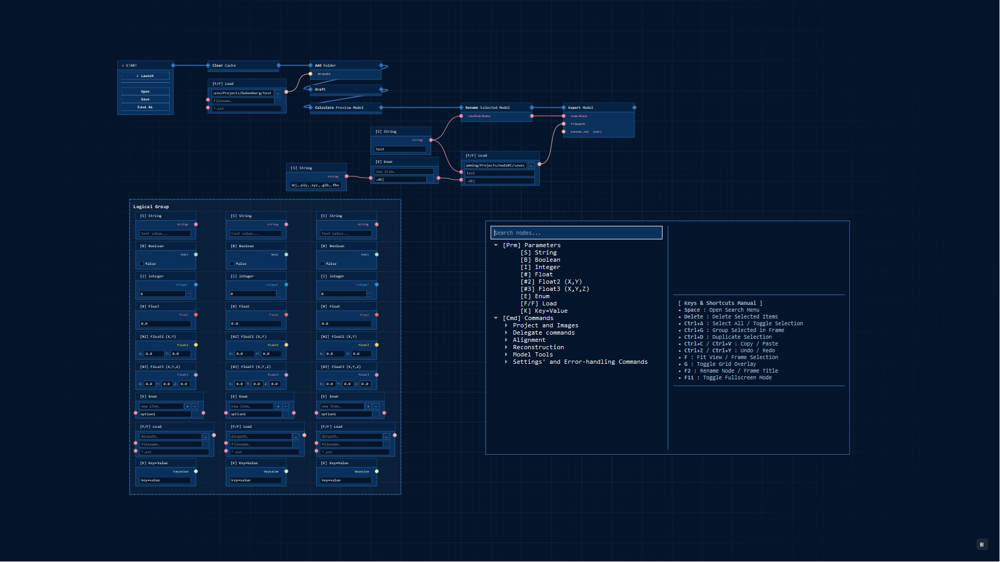

# NodeRC



[English](../README.md) | [Українська](README.uk.md) | [Español](README.es.md) | [中文](README.zh.md) | [Français](README.fr.md) | [Deutsch](README.de.md) | [日本語](README.ja.md) | [हिन्दी](README.hi.md) | [Português](README.pt.md) | [العربية](README.ar.md)

NodeRC es una interfaz visual y editor basado en nodos no oficial para los comandos de la CLI de RealityCapture / RealityScan. Escrito en Python utilizando PyQt5, el proyecto te permite conectar y gestionar visualmente nodos de comandos en un lienzo interactivo, proporcionando una interfaz cómoda para la automatización de flujos de trabajo.

## Características

- **Lienzo interactivo (Canvas):** Un espacio de trabajo infinito con soporte para desplazamiento y zoom.
- **Arquitectura de nodos:** Varios tipos de nodos que soportan conexiones entrantes y salientes (sockets).
- **Conexiones dinámicas:** Enlace visual de puertos de ejecución y puertos de datos.
- **Sistema de configuración:** Colores, tamaños y estilos personalizables a través de un archivo de configuración centralizado.
- **Menú de búsqueda:** Un menú conveniente para agregar rápidamente nuevos nodos al lienzo.

## Requisitos

- Python 3.7+
- PyQt5

## Instalación

1. Clona el repositorio:

   ```bash
   git clone <URL_del_repositorio>
   cd nodeRC
   ```

2. Instala las dependencias:
   ```bash
   pip install -r requirements.txt
   ```

## Uso

Para iniciar el editor, ejecuta:

```bash
python nodeRC.py
```

## Estructura del proyecto

- `nodeRC.py` - Punto de entrada principal.
- `canvas.py` - Lógica del lienzo interactivo y gestión de gráficos.
- `nodes.py` - Clases base y especializadas para nodos y sockets.
- `configuration.py` - Archivo de configuración (colores, estilos, parámetros de interfaz).
- `search_menu.py` - Diálogo para buscar y agregar nodos.
- `diagnostics.py` - Registro y manejo de excepciones.
- `rc_documentation_extractor.py` - Utilidad para extraer documentación de comandos.

## Licencia

Este proyecto se distribuye "tal cual". Consulta los archivos del proyecto para más información.

## Descargo de responsabilidad

Este proyecto es una herramienta independiente y de código abierto no oficial, y no está afiliado, respaldado, patrocinado ni asociado con Capturing Reality, Epic Games ni ninguna de sus filiales. "RealityCapture" y "RealityScan" son marcas comerciales o marcas comerciales registradas de Epic Games, Inc. o sus filiales.
