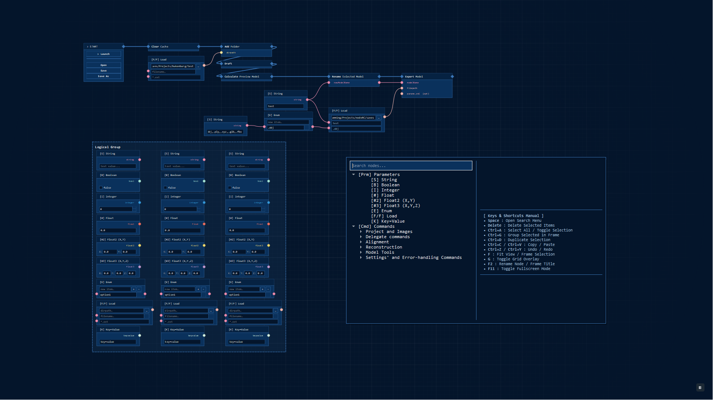

# NodeRC



[English](../README.md) | [Українська](README.uk.md) | [Español](README.es.md) | [中文](README.zh.md) | [Français](README.fr.md) | [Deutsch](README.de.md) | [日本語](README.ja.md) | [हिन्दी](README.hi.md) | [Português](README.pt.md) | [العربية](README.ar.md)

NodeRC — це неофіційна графічна надбудова та редактор у вигляді нод для команд RealityCapture / RealityScan CLI. Проєкт написаний на Python з використанням PyQt5 і дозволяє візуально з'єднувати та керувати нодами команд на інтерактивному полотні, надаючи зручний інтерфейс для автоматизації робочих процесів.

## Особливості

- **Інтерактивне полотно (Canvas):** Нескінченний робочий простір із підтримкою панорамування та масштабування.
- **Нодова архітектура:** Різні типи нод із підтримкою вхідних та вихідних з'єднань (сокетів).
- **Динамічні з'єднання:** Візуальне зв'язування портів виконання та портів даних.
- **Система конфігурації:** Налаштовувані кольори, розміри та стилі через централізований файл конфігурації.
- **Меню пошуку:** Зручне меню для швидкого додавання нових нод на полотно.

## Вимоги

- Python 3.7+
- PyQt5

## Встановлення

1. Клонуйте репозиторій:

   ```bash
   git clone <URL_репозиторію>
   cd nodeRC
   ```

2. Встановіть залежності:
   ```bash
   pip install -r requirements.txt
   ```

## Запуск

Для запуску редактора виконайте:

```bash
python nodeRC.py
```

### Керування та гарячі клавіші

- **Перетягування полотна:** Натисніть і утримуйте **середню кнопку миші (MMB)** та перетягуйте.
- **Масштабування:** Прокручуйте **коліщатко миші**.
- **Додати ноду:** Натисніть **Пробіл** або клацніть **правою кнопкою миші** на порожньому місці для відкриття меню пошуку. Виберіть ноду команди чи параметра.
- **З'єднання сокетів:** Протягніть лінію від вихідного сокета до вхідного.
  - Перетягування лінії з сокета на порожнє місце відкриває меню пошуку для автоматичного підключення нової ноди.
- **Видалити ноду/з'єднання:** Виберіть елемент і натисніть клавішу **Delete**.
- **Групування:** Виберіть кілька нод і натисніть **Ctrl + G**, щоб об'єднати їх у рамку.
- **Дублювати ноди:** Виберіть ноди та натисніть **Ctrl + D**.
- **Копіювати / Вставити:** Виберіть ноди та натисніть **Ctrl + C** для копіювання, і **Ctrl + V** для вставки в позицію курсору.
- **Скасувати / Повторити:** Натисніть **Ctrl + Z** для скасування та **Ctrl + Y** (або **Ctrl + Shift + Z**) для повторення.
- **Виділити все:** Натисніть **Ctrl + A**.
- **Сітка:** Натисніть **G** для перемикання видимості сітки.
- **Вписати в екран:** Натисніть **F**, щоб фокусувати камеру на виділених нодах (або на всіх, якщо нічого не виділено).
- **Перейменувати ноду:** Виділіть ноду параметра та натисніть **F2**.
- **Повний екран:** Натисніть **F11**.

### Процес роботи (Execution Workflow)

1. **Початок ланцюжка:** Нода `> START` завжди присутня на полотні.
2. **Додавання команд:** Натисніть **Пробіл** та додайте ноди команд (наприклад, `-addFolder`, `-align` тощо).
3. **Ланцюжок виконання:** Послідовно з'єднайте сокети виконання (у формі стрілок), починаючи від виходу ноди `> START`.
4. **Налаштування параметрів:** Створіть ноди параметрів (String, Integer, Float, File/Dir Path) та з'єднайте їхні виходи з входами нод команд.
5. **Запуск:** Натисніть кнопку **> Launch** на ноді `> START`, щоб запустити ланцюжок команд у RealityCapture.


## Структура проєкту

- `nodeRC.py` - Головна точка входу.
- `ui/editor_window.py` - Головне вікно редактора: гарячі клавіші, історія скасувань, діалоги проєкту.
- `ui/scene.py` - Сцена полотна, перетягування з'єднань та обробка подій візуальних елементів.
- `ui/view.py` - Логіка відображення графу, панорамування та масштабування.
- `ui/graph_items.py` - Візуальні елементи сцени: сокети, з'єднання, відмальовування нод та рамок.
- `ui/command_nodes.py` - Класи нод Start та Command.
- `ui/param_nodes.py` - Класи параметричних нод (String, Bool, Integer, Float, Enum, Path тощо).
- `core/node_blueprint.py` - Специфікації нод/сокетів та побудова визначень команд і параметрів.
- `core/graph_serialization.py` - Єдиний формат знімків для збереження/завантаження/копіювання/скасувань.
- `core/chain_execution.py` - Побудова виклику RealityCapture CLI з графу нод.
- `core/command_database.py` - Завантаження розпарсеного каталогу команд RealityCapture.
- `ui/theme.py` - Похідні кольори та стилі Qt для вбудованих віджетів.
- `ui/color_picker.py` - Спливаюче вікно вибору кольору HSVA.
- `ui/inset_fill_checkbox.py` - Спільний примітив чекбоксу.
- `ui/flag_icon.py` - Іконка вікна, що відображає активну мову інтерфейсу.
- `configuration.py` - Єдине джерело правди для стилів, налаштувань UI та гарячих клавіш.
- `ui/search_menu.py` - Діалог пошуку з автодоповненням для створення нод.
- `diagnostics.py` - Обробник винятків та логування помилок.
- `localization.py` - Рівень перекладу інтерфейсу на основі gettext.
- `core/rc_documentation_extractor.py` - Утиліта для побудови бази даних команд на основі локальної документації RealityCapture.

## Ліцензія

Проєкт поширюється "як є". Дивіться файли проєкту для додаткової інформації.

## Відмова від відповідальності

Цей проєкт є незалежним неофіційним інструментом з відкритим вихідним кодом і не є афілійованим, схваленим, спонсорованим або пов'язаним із Capturing Reality, Epic Games або будь-якою з їхніх дочірніх компаній. "RealityCapture" та "RealityScan" є торговими марками або зареєстрованими торговими марками Epic Games, Inc. або її дочірніх компаній.
